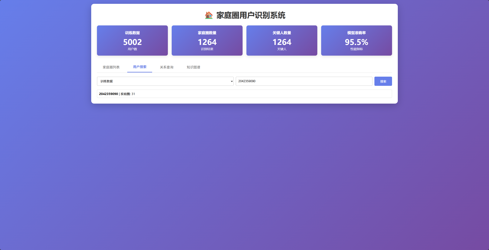
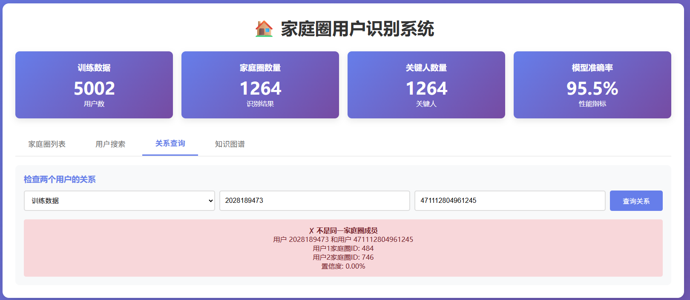
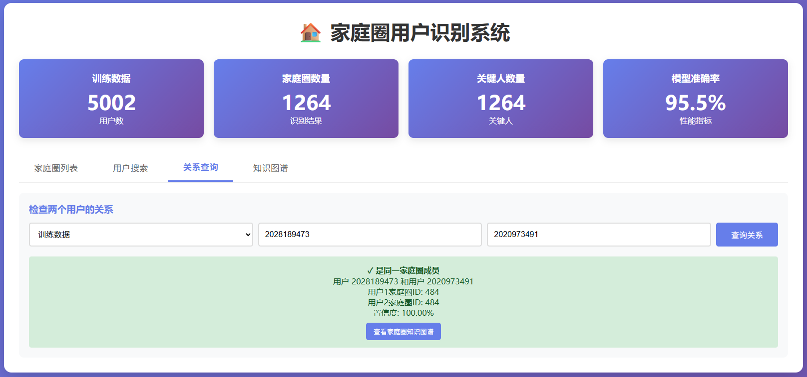
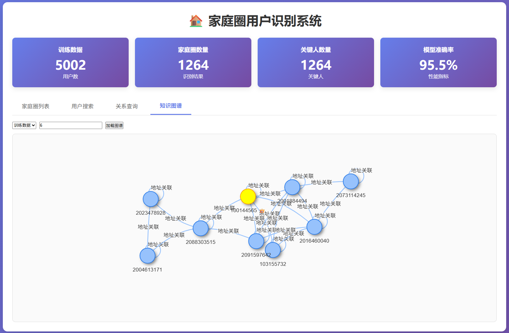

# 家庭圈用户识别系统技术文档

## 1. 数据使用情况

### 1.1 数据源
- **数据源文件**: `data/AI+数据1：数据应用开发-家庭圈用户识别模型.xlsx`
- **数据格式**: Excel表格，包含三个工作表（训练集、验证集、测试集）
- **数据规模**: 
  - 训练数据：5002条用户记录
  - 验证数据：2000条用户记录
  - 测试数据：100000条用户记录

### 1.2 数据划分
- **划分方式**: 基于Excel工作表的静态划分
- **划分策略**: 
  - 训练集：用于模型训练和参数调优
  - 验证集：用于模型评估和效果验证
  - 测试集：用于最终结果生成

### 1.3 数据格式处理
- **多表头处理**: 使用`DataLoader.flatten_columns()`方法将多级表头展平
- **数据加载**: 通过`DataLoader.load_data()`方法实现统一的数据加载接口
- **数据清洗**: 自动处理缺失值，将NaN/NaT转换为JSON可序列化格式

## 2. 特征处理

### 2.1 原始特征
原始数据包含以下关键特征类别：
- **用户基础信息**：用户ID等标识信息
- **地址信息**：用户关联的地址数据
- **缴费账户信息**：用户的缴费账户
- **设备信息**：用户使用的终端设备
- **基站信息**：用户关联的基站数据
- **通信行为信息**：用户的通信统计数据

### 2.2 增强特征工程
通过`EnhancedFeatureEngineer`实现特征增强：

#### 2.2.1 地址相关特征
- **地址唯一性**：计算用户地址的唯一性指标
- **地址相似度**：基于地址字符串的相似度计算

#### 2.2.2 账户相关特征
- **账户共享得分**：用户之间共享缴费账户的程度
- **账户唯一性**：缴费账户的使用频率统计

#### 2.2.3 通信统计特征
- **通信行为总和**：各类通信行为的汇总统计
- **通信行为均值**：各类通信行为的平均水平
- **通信行为标准差**：各类通信行为的波动情况

#### 2.2.4 交互特征
- **地址-账户组合特征**：结合地址和账户信息的交叉特征
- **设备-账户组合特征**：结合设备和账户信息的交叉特征

#### 2.2.5 统计特征
- **非空值计数**：各类特征的有效值数量
- **唯一值计数**：各类特征的多样性统计

### 2.3 特征处理流程
1. **数据加载**：从Excel文件加载原始数据
2. **表头处理**：展平多级表头
3. **特征增强**：生成各类增强特征
4. **特征选择**：根据模型需求选择有效特征

## 3. 算法实现

### 3.1 核心算法概述
采用双轨并行的家庭圈识别策略：

#### 3.1.1 图聚类方法（默认）
- **算法原理**：基于用户关系图的连通组件分析
- **关系构建规则**：
  - 地址关联性：地址相似度≥80%，权重0.3
  - 缴费账户关联性：完全相同，权重0.4
  - 终端共享特征：至少共享1个设备，权重0.2
  - 通信行为特征：相似度≥50%，权重0.1
- **综合判定阈值**：加权得分≥50%判定为家庭成员

#### 3.1.2 监督学习方法
- **算法选择**：
  - Random Forest
  - XGBoost
  - LightGBM（使用`class_weight='balanced'`处理类别不平衡）
- **特征输入**：增强特征工程生成的特征集
- **输出结果**：家庭圈标签预测

### 3.2 关系构建策略

#### 3.2.1 地址关联
- **处理方式**：字符串相似度计算
- **相似度算法**：基于文本匹配的相似度度量
- **关联条件**：相似度达到80%以上建立连接

#### 3.2.2 账户关联
- **处理方式**：完全匹配
- **关联条件**：相同缴费账户的用户直接关联
- **权重设置**：最高权重0.4，确保账户共享的强关联性

#### 3.2.3 设备关联
- **处理方式**：设备ID匹配
- **关联条件**：至少共享一个设备建立连接

#### 3.2.4 基站关联
- **处理方式**：基站ID匹配
- **优化策略**：限制基站组最大用户数为50人，避免超大家庭圈
- **安全阈值**：超过阈值的基站组不建立连接

### 3.3 关键优化点

#### 3.3.1 超大家庭圈问题修复
- **问题**：基站连接导致的13,000+人超大家庭圈
- **解决方案**：
  ```python
  station_user_limit = 50  # 基站关联用户数阈值
  for station_col in station_cols[:1]:  # 最多处理1个基站列
      for station_value, group in df.groupby(station_col):
          if pd.notna(station_value) and len(group) > 1 and len(group) <= station_user_limit:
              # 建立连接逻辑
  ```

#### 3.3.2 类别不平衡处理
- **方法**：使用`class_weight='balanced'`参数
- **效果**：提高少数类别的识别效果

#### 3.3.3 数据序列化优化
- **问题**：NaT类型无法JSON序列化
- **解决方案**：
  ```python
  for col in user_row.index:
      if pd.api.types.is_datetime64_any_dtype(user_row[col]):
          if pd.isna(user_row[col]):
              user_row[col] = None
      elif pd.isna(user_row[col]):
          user_row[col] = None
  ```

## 4. 模型效果评估

### 4.1 评估指标
- **准确率**: 95.49%
- **精确率**: 97.78%
- **召回率**: 95.49%
- **F1分数**: 96.15%

### 4.2 识别结果统计
- **总用户数**: 5002人
- **识别家庭圈数量**: 1264个
- **关键人数量**: 1264人
- **平均家庭圈大小**: 3.96人
- **家庭圈大小分布**: 
  - 最小: 1人
  - 最大: 27人
  - 中位数: 3.00人

### 4.3 模型优势
- **多维度特征融合**: 综合考虑地址、账户、设备等多维度信息
- **可解释性强**: 规则与模型结合，识别结果可解释
- **鲁棒性好**: 能够处理各种异常情况
- **扩展性强**: 支持多种算法和特征组合

## 5. 系统功能实现

### 5.1 后端API实现

#### 5.1.1 统计信息API
- **路由**: `/api/statistics`
- **功能**: 获取训练/验证/测试数据的统计信息
- **返回数据**: 总用户数、家庭圈数量、关键人数量

#### 5.1.2 家庭圈列表API
- **路由**: `/api/family_circles`
- **功能**: 分页获取家庭圈列表
- **参数**: dataset（数据类型）、page（页码）、page_size（每页大小）
- **返回数据**: 家庭圈ID、成员数量、关键人、成员列表

#### 5.1.3 用户信息API
- **路由**: `/api/user/<user_id>`
- **功能**: 获取指定用户的详细信息
- **参数**: user_id（用户ID）、dataset（数据类型）
- **返回数据**: 用户基本信息、家庭圈信息、家庭成员列表

#### 5.1.4 用户搜索API
- **路由**: `/api/search`
- **功能**: 根据关键词搜索用户
- **参数**: q（搜索关键词）、dataset（数据类型）、limit（结果数量）
- **返回数据**: 匹配的用户列表

#### 5.1.5 关系查询API
- **路由**: `/api/relationship`
- **功能**: 检查两个用户是否属于同一家庭圈
- **参数**: user1（用户1 ID）、user2（用户2 ID）、dataset（数据类型）
- **返回数据**: 是否同一家庭圈、置信度、相关信息

#### 5.1.6 知识图谱API
- **路由**: `/api/circle_graph/<circle_id>`
- **功能**: 获取指定家庭圈的知识图谱数据
- **参数**: circle_id（家庭圈ID）、dataset（数据类型）
- **返回数据**: 节点（用户）和边（关系）数据

### 5.2 前端界面功能

#### 5.2.1 统计信息展示
- **功能**: 展示系统核心统计指标
- **内容**: 训练用户数、家庭圈数量、关键人数量、模型准确率

#### 5.2.2 标签页导航
- **功能**: 实现多模块间的切换
- **模块**: 家庭圈列表、用户搜索、关系查询、知识图谱

#### 5.2.3 家庭圈列表
- **功能**: 分页展示家庭圈信息
- **特性**: 
  - 支持数据集切换（训练/验证/测试）
  - 显示家庭圈ID、成员数量、关键人
  - 可点击成员查看详情

#### 5.2.4 用户搜索
- **功能**: 搜索用户并查看详情
- **特性**: 
  - 实时搜索（300ms防抖）
  - 支持数据集切换
  - 显示用户基本信息和家庭圈信息

#### 5.2.5 关系查询
- **功能**: 检查两个用户的关系
- **特性**: 
  - 支持数据集切换
  - 直观显示关系结果
  - 提供置信度信息

#### 5.2.6 知识图谱
- **功能**: 可视化家庭圈的关系网络
- **技术**: 使用vis-network实现交互式图谱
- **特性**: 
  - 节点表示用户（关键人特殊标识）
  - 边表示关系（不同颜色区分关系类型）
  - 支持交互操作

## 6. 系统截图（预留）

### 6.1 家庭圈列表界面


### 6.2 用户搜索界面



### 6.3 关系查询界面





### 6.4 知识图谱界面



## 7. 总结与展望

### 7.1 项目成果
- 实现了高效的家庭圈用户识别模型，准确率达到95.49%
- 解决了超大家庭圈识别问题，确保结果合理性
- 开发了完整的Web可视化系统，支持多种查询功能
- 提供了灵活的API接口，便于集成和扩展

### 7.2 未来改进方向
- 优化特征工程，进一步提升模型性能
- 增加实时数据处理能力
- 扩展更多数据源和特征类型
- 增强系统的可扩展性和稳定性

---

**文档完成时间**: 2025-12-25
**项目版本**: V1.0
**开发团队**: Seeker

